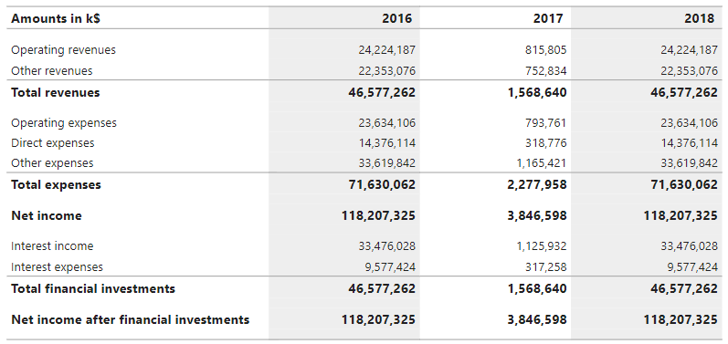
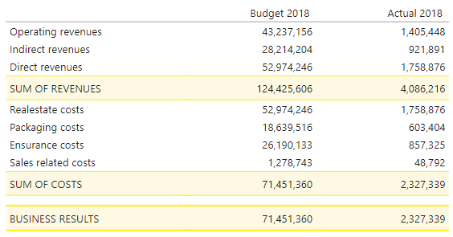

# Summary Table Power BI Custom Visual


A summary table showing an income statement with two summary levels.



A summary table showing an income statement with yellow highlighting.

## The JSON structure
```json
{
	"columns": [...],
	"rows": [...],
	"headerRow": {...}
}
```

### Define columns - `columns`
#### Example
```json
{
	"headerStyle": "text-align:left",
	"rowStyle": "text-align:left",
	"width": 260,
	"type": "RowHeader",
	"refName": "[AccountGroup]", 
	"title": "Amounts in k$",
	"calculationFormula": "", 
	"format": ""
}
```
#### Properties
* **headerStyle** - the css style of the header of  the column.
* **rowStyle** - the css style of the row items of the column.
* **width** - the width in pixels of the column.
* **type** - the type of column. Valid values are RowHeader, Data and Calculation. RowHeader is used for the first column that contains the header for each row. Data is used for a column that is bound to a measure. Calculation is used when a specific calculation should be applied at render-time.
* **refName** - the name of the data bound measure/attribute. Only applicable when using RowHeader and Calculcation type.
* **title** - the displayed title of the column.
* **calculationFormula** - the formula that should be applied when using the Calculation type. E.g. "[Savings SEK]/[Spend SEK]". Measures are referenced betweeen brackets ([]). Allowed operators are: + - / *
* **format** - the formatting that should be applied when rendered. E.g. "#,0" and "0.0 %;-0.0 %;0.0 %".


## Known issues & limitations
